# Tetris

       

**Writen by** @1751130

**Live Demo :**  [http://47.100.60.154/](http://47.100.60.154/)

This is the web final project - a Multiplayer online match or cooperation (still on building) tetris game (also including stand-alone version).

<h4 align="center">Index Page</h4>

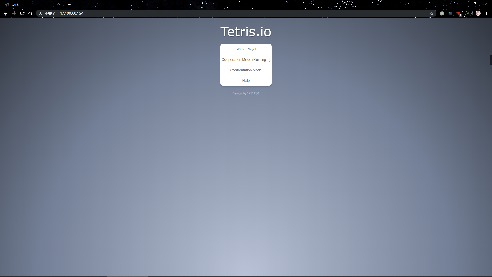

<h4 align="center">Single Player Page</h4>

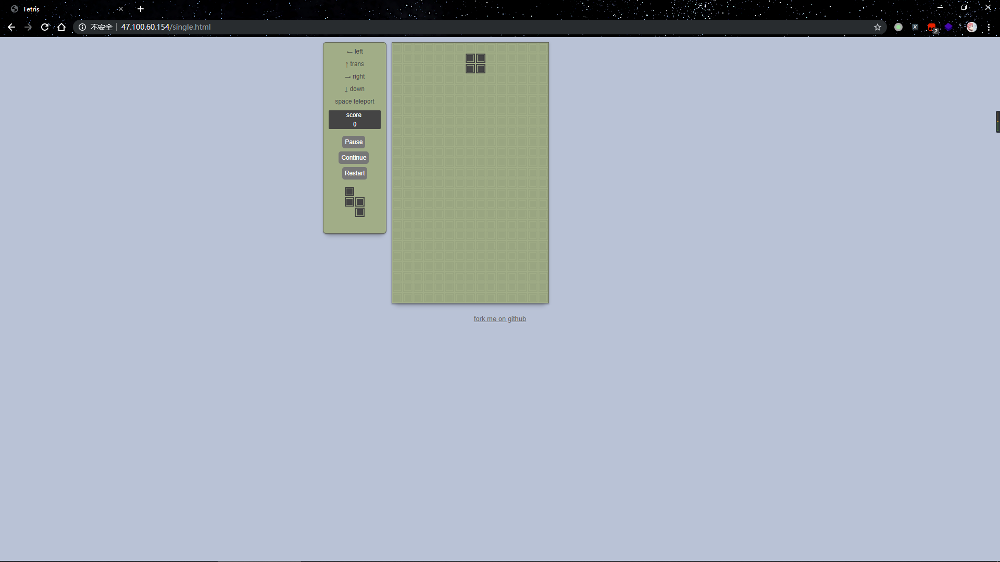

<h4 align="center">On the mobile phone</h4>

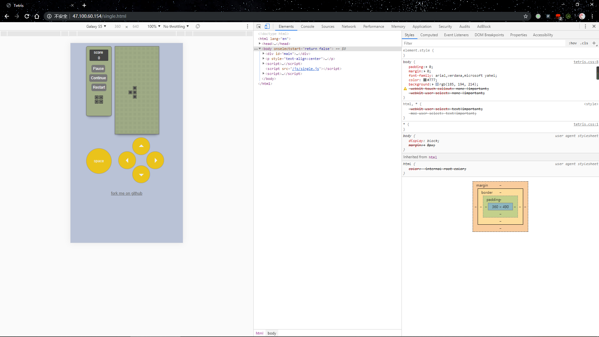

<h4 align="center">Confrontation Mode Page</h4>

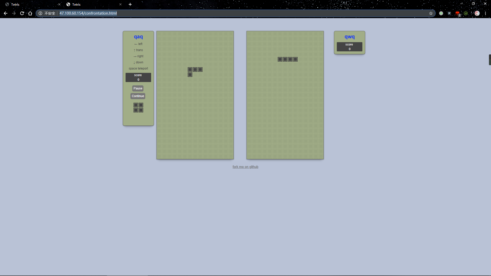

<h4 align="center">Confrontation Mode Page 2</h4>

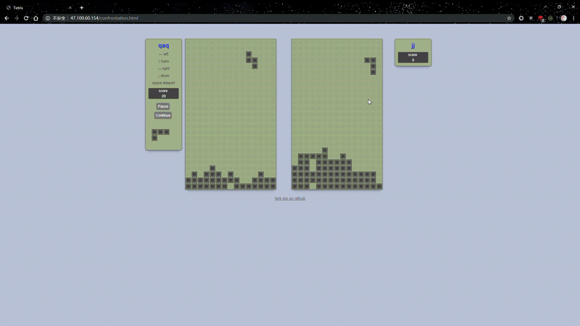


<h4 align="center">Cooperation Mode Page <span style="color:rgba(0,0,0,0.5); font-size:16px"> (Still on building)</span></h4>

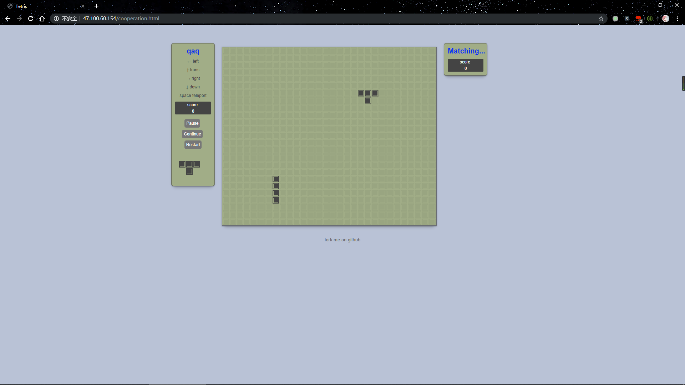

<h4 align="center">Help Page</h4>

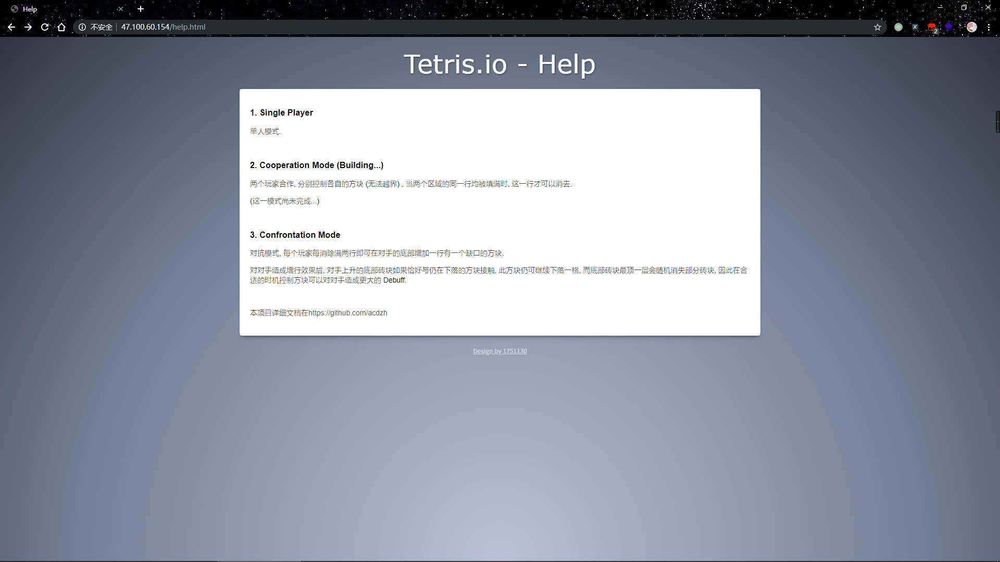

## Project Structure

```bash
└─TC_WEB_Project-tetris
    │  .gitignore
    │  LICENSE
    │  package.json
    │  README.md
    │  server.js
    │  yarn.lock
    │
    ├─.git
    ├─log
    │      access.log
    │
    ├─node_modules
    └─public
        │  confrontation.html
        │  cooperation.html
        │  help.html
        │  index.html
        │  single.html
        │
        ├─css
        │      confrontation.css
        │      cooperation.css
        │      help.css
        │      index.css
        │      tetris.css
        │
        └─js
                confrontation.js
                cooperation.js
                single.js
                socket.io.js
```

## Getting Started

### Prerequisites

What things you need to install the software and how to install them.

```
1. Node.js
2. yarn (recommend) or npm
```

### Deployment

```bash
cd ./TC_WEB_Project-tetris
yarn install
node server.js
```

## How does it work

### Tetris

The core code of tetris is in the `/public/js/single.js`. 

At first we can use a two-dimensional array like `[[0, 0, 0, 1], [1, 1, 1, 1]]` to store the map or the bricks. But in this way, to move a brick on the map may be a complex thing. For example, We need at least four functions to move a brick up, down, left or right. And it is also difficult to detect whether a collision happend between a brick and ground or walls.

Every row of the map and a brick is descripted by a one-dimensional array whitch is composed of 1 and 0, so we can use a integer to replace it. Now the map array change to like this : `[1, 15, ... , 0]`. The bricks' array are like these:

```js
var a = [ [4, 14], [4, 6, 4], [0, 14, 4], [4, 12, 4] ];		// ┴,   ├, ┬, ┤
var b = [ [4, 4, 6], [0, 14, 8], [12, 4, 4], [2, 14] ];		// ┘, ┌───, ┐, ──┘
var c = [ [4, 4, 12], [8, 14], [6, 4, 4], [0, 14, 2] ];		// 上一个的左右镜像
var d = [ [6, 6] ];											// 方块
var e = [ [12, 6], [4, 12, 8] ];							// z, 竖起来的z
var f = [ [6, 12], [4, 6, 2] ];								// 上一个的左右镜像
var g = [ [4, 4, 4, 4], [0, 15] ];							// |, ───

var titles = [a, b, c, d, e, f, g, a, b, c, d, e, f, g];
```

Every trick, the js pick a species of tricks in the array `titles` randomly, then select a rotation of it. But for frequency equalization, I modify the code to these:

```js
var a = [ [4, 14], [4, 6, 4], [0, 14, 4], [4, 12, 4] ];		// ┴,   ├, ┬, ┤
var aa = [ [4, 14], [4, 6, 4], [0, 14, 4], [4, 12, 4] ];	// ┴,   ├, ┬, ┤
var b = [ [4, 4, 6], [0, 14, 8], [12, 4, 4], [2, 14] ];		// ┘, ┌───, ┐, ──┘
var c = [ [4, 4, 12], [8, 14], [6, 4, 4], [0, 14, 2] ];		// 上一个的左右镜像
var d = [ [6, 6] ];											// 方块
var dd = [ [6, 6] ];										// 方块
var e = [ [12, 6], [4, 12, 8] ];							// z, 竖起来的z
var f = [ [6, 12], [4, 6, 2] ];								// 上一个的左右镜像
var g = [ [4, 4, 4, 4], [0, 15] ];							// |, ───
var gg = [ [4, 4, 4, 4], [0, 15] ];							// |, ───

var tiles = [a, b, c, d, e, f, g, a, b, c, d, e, f, g, aa, dd, gg];
```

Then the bricks' move change to some interges' addition. Every trick we just need to do three things: minus the brick from the map, add the new brick in the map, check if this situation is correct, then render the map to the div `stage`.

### Rendering

In the page `single.html`, there is a div whose id is `stage`. In this `stage`, there are many small divs whose class is `"on"` or none. Every rendering use the map array stored the bricks and ground's info to modify these small divs' class, then they can display because of diffient css.

<h4 align="center">the divs</h4>

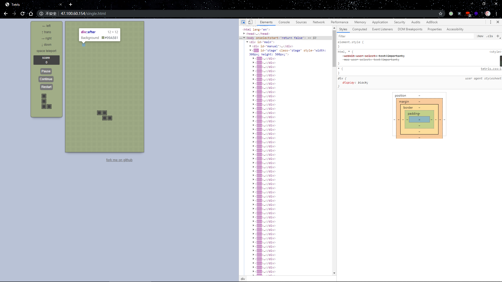

A tetris is a class. When it is initializate, I registered some events of physical or virtual buttons' click. Also, I registered some events outside of this class to render for the tetris class.

### Communication

What I said before is about the core part of codes. But how does it work in the two players mode? Which lib we used to communicate duplexly is [Socket.io](https://github.com/socketio/socket.io). 

To install it, at the front-end, we just need to introduce the `socket.io.js` in the `<head>` part like `<script src="https://cdn.bootcss.com/socket.io/2.2.0/socket.io.js"></script>`, and at the back-ehd, we need to add the package to our project by using `yarn add socket.io` or `npm install socket.io --save`. It's worth nothing that we should add the package named `socket.io` instead of `socketio`, because the latter is the old version and it may cause some bugs when send Chinese because of unmatched version of the front-end and the back-end.

Then we can use socket.io to send message from client to server or the opposite.

<h4 align="center">use socket.io on the server</h4>

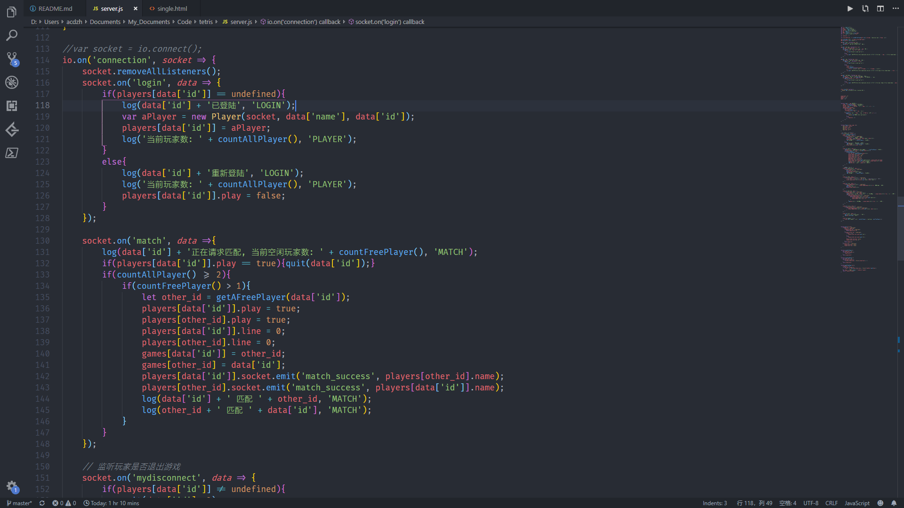

And on the server, user's id is composed of his or her name and the timestamp when he or she login.

### Router

On the server, I use the Express.js as the web frame.

### Log System

#### The express log

using the package named morgan and store log in the `log/access.log`.

#### game log

The log system of game is writen by myself. Here is the function: 

```js
var logsCache = [];

function log(str, type="UNTYPE"){
    today = sd.format(new Date(), 'YYYY-MM-DD');
    nowtime = sd.format(new Date(), 'HH:mm:ss');
    thelog = today + ' ' + nowtime + '\t['  + type + ']\t' + str + '\n';
    logsCache.push(thelog);
    if(logsCache.length > 20){
        var strToWrite = ""
        logsCache.forEach(log =>{
            strToWrite += ('<p>' + log + '</p>');
        });
        fs.appendFile('log/' + today + '.log', strToWrite, 'utf8', err => {
            if(err){
                console.log("ERROR: Write log failed!");
            }
            else{
                logsCache = [];
            }
        });
    }
};
```

#### How to load logs

When the `/log` page has been visited, server goto read the log directory to find how many logs in there, then return the directory of links in the html.

When visited `/log/xxx.log` like `/log/2019-06-06.log`, server return all logs formated on that day.

Code:

```js
app.get('/log/:day', function(req, res){
    var day = req.params.day;
    log(req.ip + ' has just visited /log/' + day, 'URL');
    fs.readFile('log/' + day, (err, data) => {
        if(err){
            res.send("Failed to read log file!");
        }
        else{
            res.send('<!DOCTYPE html><html><head><meta charset=\"utf-8\"><title>log: ' + day + '</title></head><body>' + data.toString() + '</body></html>');                                       
        }
    });
});

app.get('/log', function(req, res){
    log(req.ip + ' has just visited /log', 'URL');
    fs.readdir("log/", function(err, files){
        if(err){
            res.send("Failed to read log file!");
        }
        else{
            links = "";
            files.reverse();
            files.forEach(function(filename){
                links += '<a href=\"log/' + filename + '\">' + filename + '</a><br>';
            });
            res.send('<!DOCTYPE html><html><head><meta charset=\"utf-8\"><title>logs</title></head><body>' + links + '</body></html>');                                       
        }
    });
});
```

<h4 align="center">/log page</h4>

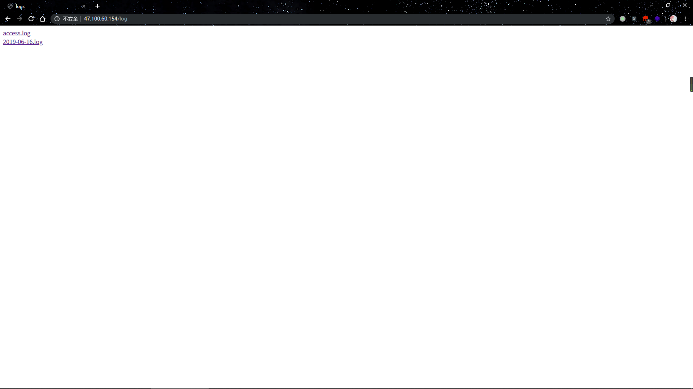

<h4 align="center">/log/date page</h4>

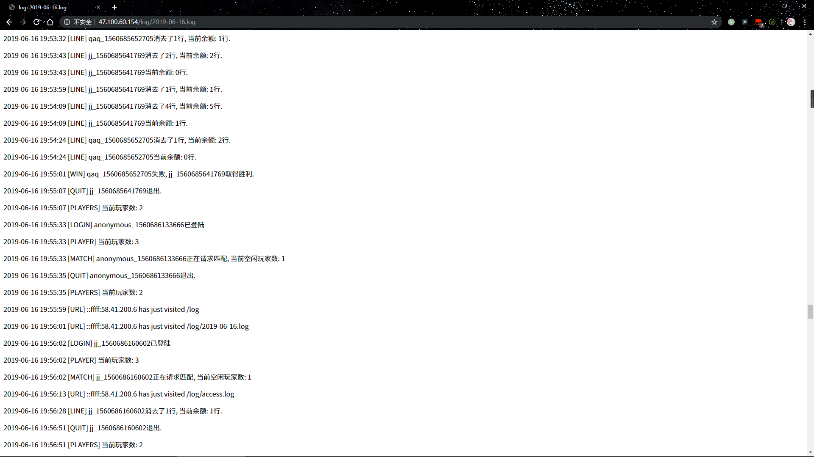


## License

This project is licensed under the WTFPL License - see the [LICENSE](LICENSE) file for details.

